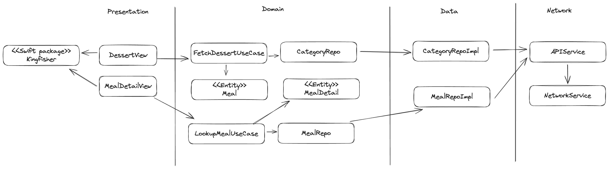

# Dessert iOS

## API

Using API from [https://themealdb.com/api.php](https://themealdb.com/api.php)

## System Design

## Screens

## Thrid Party Library
- [Kingfisher](https://github.com/onevcat/Kingfisher) for Image Cache
